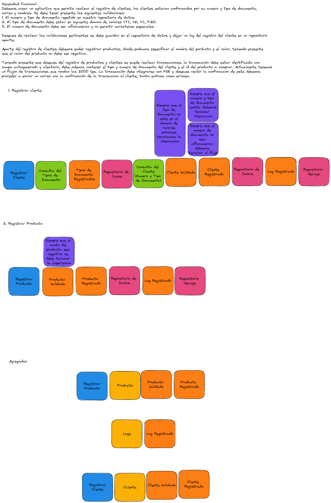

# Code Review 

El siguiente aplicativo tiene varios aspectos a mejorar, de los cuales se te solicita
que los enumeres o escribas en un archivo aparte como resultado de la prueba, el ejercicio
no consiste en arreglar el aplicativo. Te invitamos a evaluar los siguientes items:
1. Codigo limpio
2. Estandar de mensajería
3. Proncipios SOLID
4. Configuraciones de kubernetes y docker

5. Adicionalmente el aplicativo cuenta con un diseño (DDD), ¿que aspectos de la implementacion
no son fieles al diseño?

 